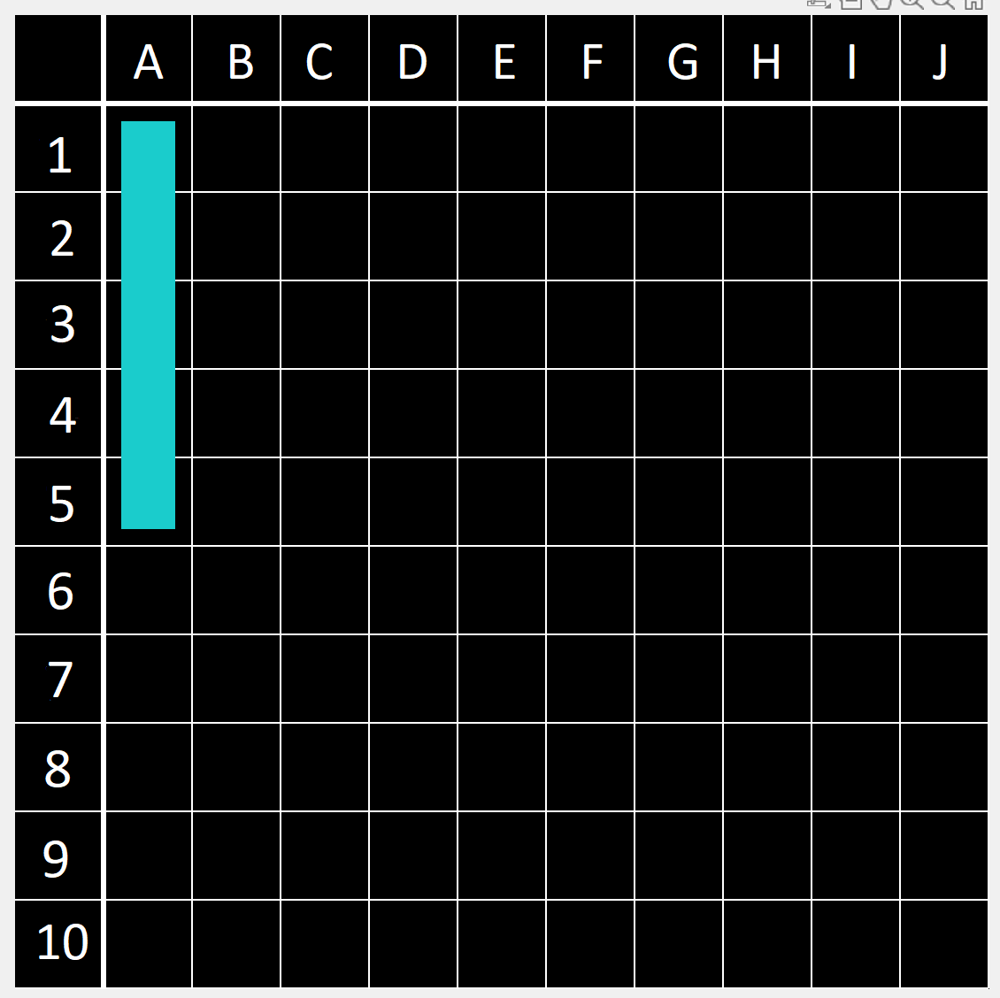
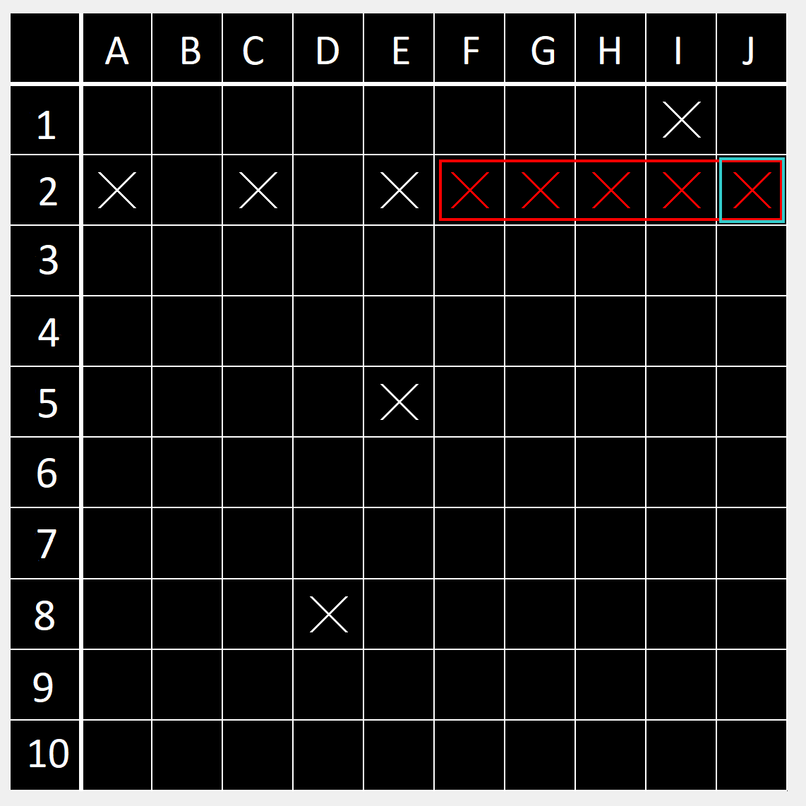
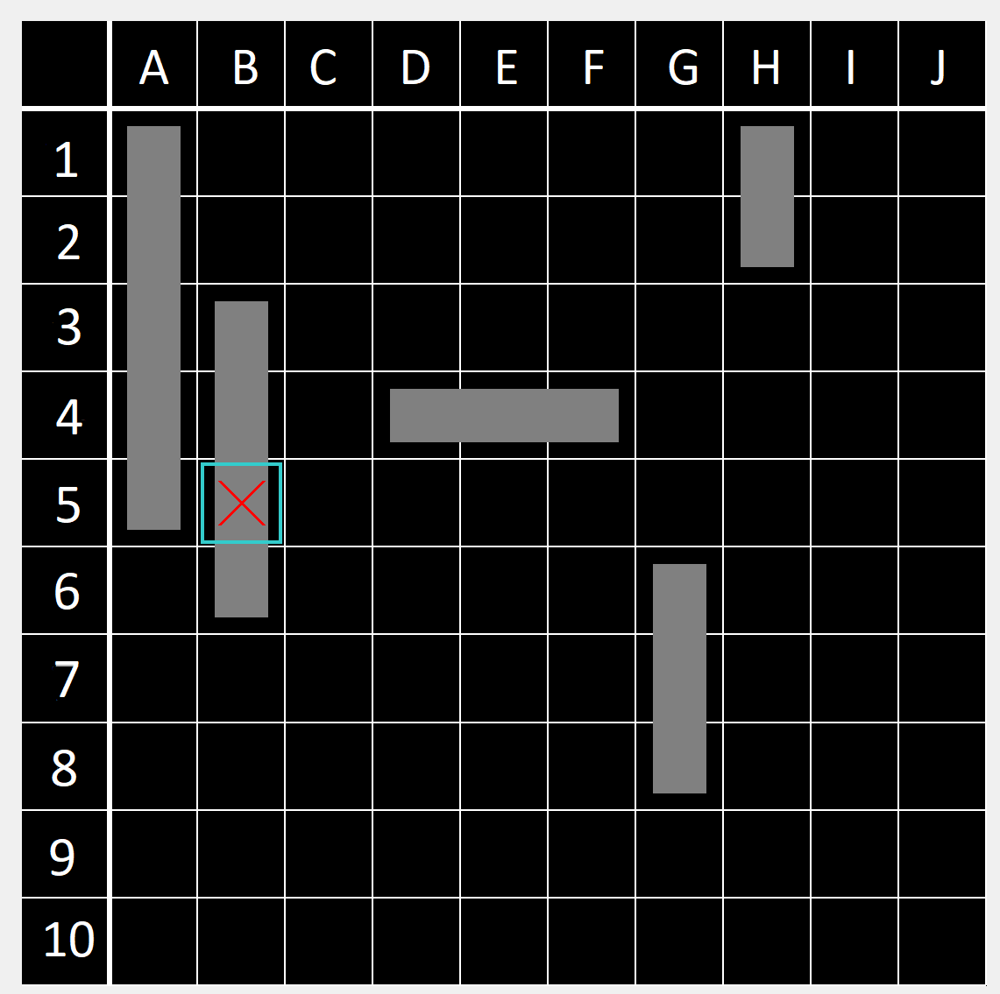

# Battleships

Date: 22/04/2023

This MATLAB implementation of Battleships utilizes the `image` function to create a graphical user interface (GUI) for the game board. The game is played on a grid where players strategically place their ships and attempt to sink their opponent's fleet by guessing coordinates.

* 10x10 Board
* Single and multi player
* 3 levels of difficulty

## Screenshots

Image for inserting boat onto board

Second player/AI versus first player

Your board

